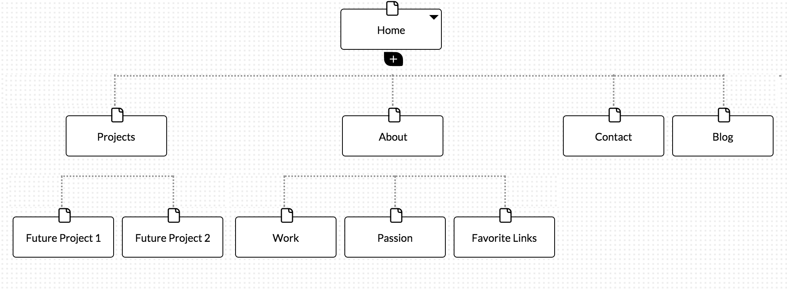

#Design Reflection

###What are the 6 Phases of Web Design?
1. Information Gathering
..* In this phase the designer should consider their goals and needs and really address what this website or project intends to serve
..* The designer should also consider the target audience and start to tailor content and design choices with these key points in mind.
2. Planning
..* With all the information from the first step in mind and documented, the planning phase is the time to develop a site map.
3. Design
..* Developing prototypes, sketches and considering user and information flow is also part of this phase.
4. Development
..* Now that we have our creative outline articulated, we can code the structure and and functionality of the site.
5. Testing and Delivery
..* Prior to launching the website or project live, complete testing!
6. Maintenance
..* Post-launch maintenance can mean correcting anything that happens to break or simply needs an update on the technical side.
..* It is also important to note that content and other elements like image or links might need to be refreshed from time to time.
..* AND - don't forget to back-up regularly ;)

###What is your site's primary goal or purpose? What kind of content will your site feature?
The primary goal of my site is to showcase my projects and resume (even though right now, those two elements are a bit scarce).
The content will be mostly professional (see list below) but I also want to include a few of my favorite links and a bit more about my hobbies and passions (second list below)

#####Professional Content
* links to social media networks
..* can't forget to link to GitHub profile here!
* photo
* contact info
* link to my new tech blog (thanks DBC!)
* work history and resume details (about me section 1)
* projects

#####Fun Content (about me section 2)
* favorite blog and podcast links
* hobbies
..* including photos
..* knitting!
..* hiking and backpacking
..* minimalism
* possibly a quote of the day...

###What is your target audience's interests and how do you see your site addressing them?
My target audience is potential employers - so hopefully their interests are me! Their interests will be mainly focused on my resume details and projects to make sure I'm up to snuff. So I plan to prioritize the professional content and make sure all my contact links and social media links function perfectly. I will also want to make sure my home page surfaces the most important details and perhaps allows users to click for more detailed information. Also, since I'm not actually a UX designer, I plan to put simple design to work for me and emphasize the UX decisions I am comfortable with. In other words, this is not the website on which I wan to experiment with design too much.

###What is the primary "action" the user should take when coming to your site? Do you want them to search for information, contact you, or see your portfolio? It's OK to have several actions at once, or different actions for different kinds of visitors.
The primary action I want users to take is to browse resume details and validate my skills with easy access to projects.
A secondary audience might be other developers who are interested in working with me or actively seeking people with whom to collaborate. In this case, I think the personal or "fun" content is just as important because I really value working with people who appreciate people and ideas - not just hard skills. So I don't plan to minimize the fun stuff too much.

###What are the main things someone should know about design and user experience?
I think this _could_ boil down to one truth: design has a great impact on user experience. It's crucial for aspiring designers to learn about user experience (UX) and explore its key tenets.

###What is user experience design and why is it valuable?
User experience design is the idea of designing projects with the end user's needs, convenience and sensitivities in mind. Key concepts are usability and human computer interactions (HCI) as well as good principals of design. It's important to note here that UX is not synonymous with usability. Whereas UX addresses they way the user feels when interacting with the end product (his or her sensitivities and general experience), usability is focused on ease of use (how efficient is the system, how user-friendly?).

UX design is valuable because as it informs our design choices, we are actively creating better experiences for the users. That may sound a bit recursive or circular but it really is that simple. It's easiest to understand the effect of UX design when you contrast it with previous design decision flow. In short - in the past designers made decisions based on their own assessments of content and creativity and balanced that with only the Yes/No test of whether the client liked the design. You can quickly imagine how this type of thinking could under-emphasize (or completely cut out) the feedback of users.

###Which parts of the challenge did you find tedious?
Ugh - that image up top! I could not get the relative path to work in my markdown file for the life of me. I finally had a brainwave - I had to move the reflection back into the imgs directory. I wanted it to be outside that directory since the title of it suggests it should only contain images... c'est la vie.

Otherwise - I find UX intuitive (so far!) and am excited to do more!