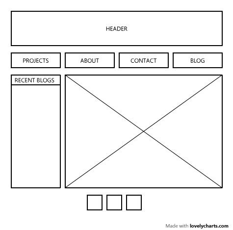
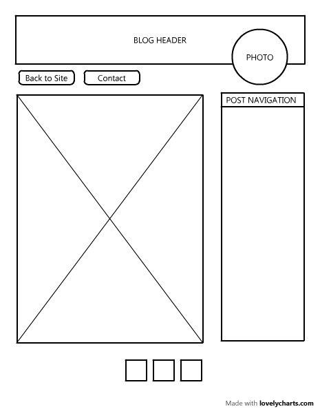

#Wireframe Reflection

###What is a wireframe?

###What are the benefits of wireframing?

###Did you enjoy wireframing your site?

###Did you revise your wireframe or stick with your first idea?

###What questions did you ask during this challenge? What resources did you find to help you answer them?

###Which parts of the challenge did you enjoy and which parts did you find tedious?