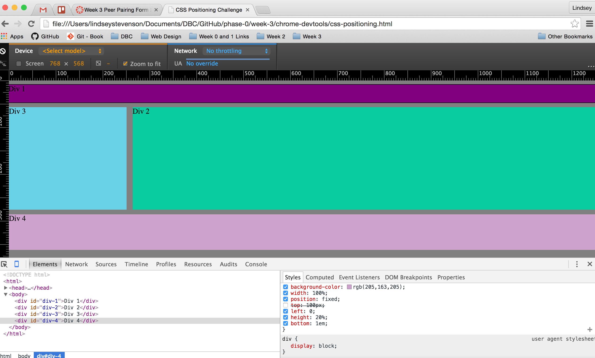

# 3.4 Reflection

Exercise 1 

Exercise 2 

Exercise 3 

Exercise 4 

Exercise 5 

Exercise 6 

Exercise 7 

Exercise 8 

Exercise 9 

## How can you use Chrome's DevTools inspector to help you format or position elements?

Chrome's DevTools are pretty rad. One really helpful feature for me was the visual representation of the selected element with it's margins and padding properties all highlighted and dimensioned. Another nifty feature is the ability to adjust the CSS code and see live changes which allows developers to experiment with layouts and properties in real time.

## How can you resize elements on the DOM using CSS?

You can simply use the height and width properties in CSS to specify if an object should have a set size. You can also take advantage of CSS and HTML defaults that allow elements to take up the width of the page and only adjust their position properties in CSS to effectively re-size elements in relation to one another.

## What are the differences between absolute, fixed, static, and relative positioning? Which did you find easiest to use? Which was most difficult?

To understand the 4 positions, it's important to remember (or first understand) where elements appear by default - this is called normal flow. In normal flow elements take up the width of the page and fall one after another from the top to bottom of the page. I found it easiest to think of the positions in the following order: Relative, Absolute, Fixed, Static:

* When you specify a **relative position**, you specify where an element will appear _in relation to where it would appear_ in normal flow. So if it would normally appear aligned to the left of the screen and you adjust the left property, you are moving it farther from the left (moving it right).
* When you specify an **absolute position**, you specify where the element will appear _in relation to its parent element_. So if you have a sidebar inside a div that contains both sidebar and article elements, the absolute position of sidebar is set based on the position of the div.
* When you specify a **fixed position**, you tell an element where to appear _in relation to the browser window_, meaning the element will stay put when you scroll and will _not_ affect the position of other elements on the page.
* When you specify a **static position**, you specify the default behavior of HTML elements - meaning you specify _this element will appear in normal flow_.

## What are the differences between margin, border, and padding?

* **Margin** properties control how much room appears around the border of an element
* **Border** properties control the border itself, it's thickness and line type, color, etc.
* **Padding** properties control how much room appears between the content of the element and the content inside.

I found it easiest to understand in this diagram: Margin, Border and Padding Diagram courtesy of [w3schools](http://www.w3schools.com/css/css_boxmodel.asp)

## What was your impression of this challenge overall? (love, hate, and why?)

This challenge was fun - I was really intimidated at first with the DevTools stuff but getting in there and playing around with these divs really dispelled any nerves and I'm excited to get going on my own website with CSS! I found it really solidified the CSS we've learned in a practical way. I guess I loved it because I see a lot of potential applications - who doesn't want to create beautiful websites?!