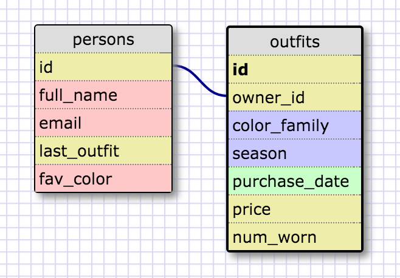

# 8.4 Introduction to Database Schemas and SQL

## Release 5: Selecting Data from a Database

### Query 1: Select all data from states:
```sqlite> select * from states;```

### Query 2: Select all data from regions:
```sqlite> select * from regions;```

### Query 3: Select state_name and population for all states:
```sqlite> select state_name, population from states;```

### Query 4: Select the state_name and population for all states ordered by population:
```sqlite> select state_name, population
   ...> from states
   ...> order by population DESC;```

### Query 5: 5. Select the state_name for the states in region 7:
```sqlite> select state_name
   ...> from states
   ...> where region_id is 7;```

### Query 6: Select the state_name and population_density for states with a population density over 50 ordered from least to most dense:
```sqlite> select state_name, population_density
   ...> from states
   ...> where population_density > 50
   ...> order by population_density ASC;```

### Query 7: Select the state_name for states with a population between 1 million and 1.5 million people:
```sqlite> select state_name
   ...> from states
   ...> where population >= 1000000
   ...> and population <= 1500000;```

### Query 8: Select the state_name and region_id for states ordered by region in ascending order:
```sqlite> select state_name, region_id
   ...> from states
   ...> order by region_id asc;```

### Query 9: Select the region_name for the regions with "Central" in the name:
```sqlite> select region_name
   ...> from regions
   ...> where region_name like '%central%';```

### Query 10: Select the region_name and the state_name for all states and regions in ascending order by region_id. Refer to the region by name. (This will involve joining the tables):
```sqlite> select regions.region_name, states.state_name
   ...> from regions
   ...> inner join states
   ...> on regions.id=states.region_id;```

## Release 6: Clueless Schema



## Release 7: Reflect

### What are databases for?

Databases are good for storing a lot of data and for storing data that is best kept in several tables with relationships with data in other tables.

### What is a one-to-many relationship?

A one-to-many relationship describes data that appears uniquely in one table but can repeat many times in other tables. It's easy to identify these relationships if you are able to verbalize using a sentence like: "X belongs to a Y" or "Y has many X's". In our data we could easily say that a region has many states. These relationships are best broken out into multiple tables.

### What is a primary key? What is a foreign key? How can you determine which is which?

A primary key is the unique identifier for that table. A foreign key is a piece of data in a second table that refers back to the row the primary key represents.

### How can you select information out of a SQL database? What are some general guidelines for that?

Use SQL syntax (which is relatively simple, refer to [w3schools.com documentation](http://www.w3schools.com/sql/)). The general guidelines could be described as:
line 1: which columns would you like to `select`?
line 2: which table are these comlumns `from`?
line 3: would you like to choose any criteria? Use `where` and `and` here.
line 4: how would you like all this data to disply? Use `order by` here.
line 5: always end with a semi-colon`;`